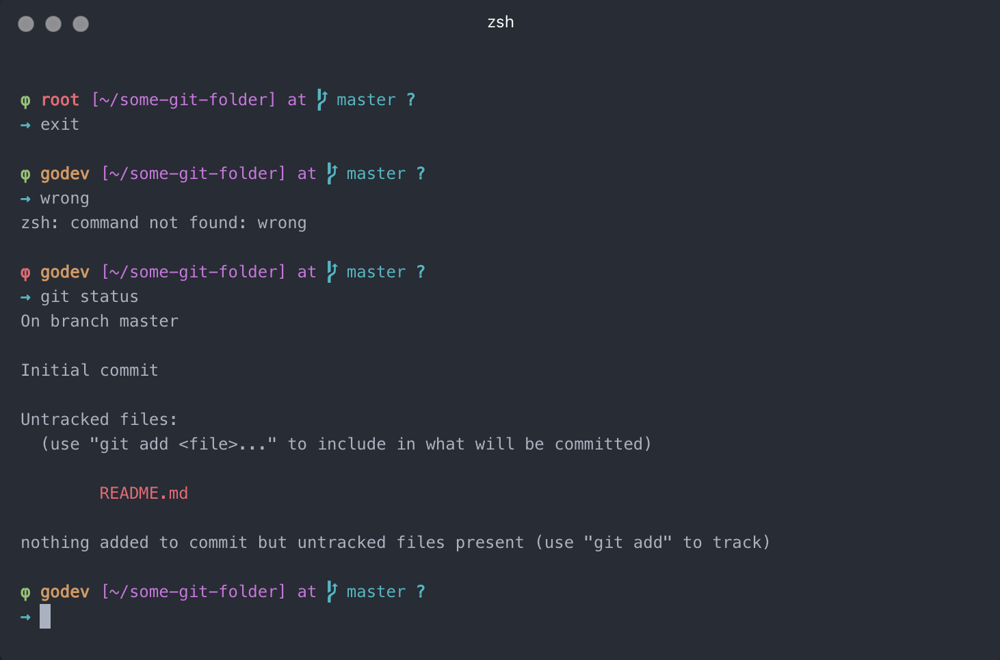

# Phi φ ZSH Theme

> Inspired and forked from [Lambda (Mod) ZSH Theme](https://github.com/halfo/lambda-mod-zsh-theme)

---

  
  

## Install

Download the **phi.zsh-theme** and place it inside the `~/.oh-my-zsh/themes` folder.

Then change the theme within the `~/.zshrc` file.

## Features

- Git branch (with alert on changes)
- Latest git commit hash
- phi color dynamic  

## License

[MIT](https://github.com/LasaleFamine/phi-zsh-theme/blob/master/LICENSE.md) &copy; LasaleFamine
